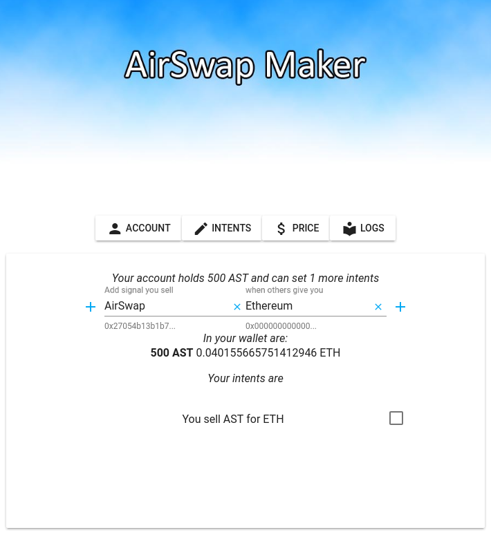
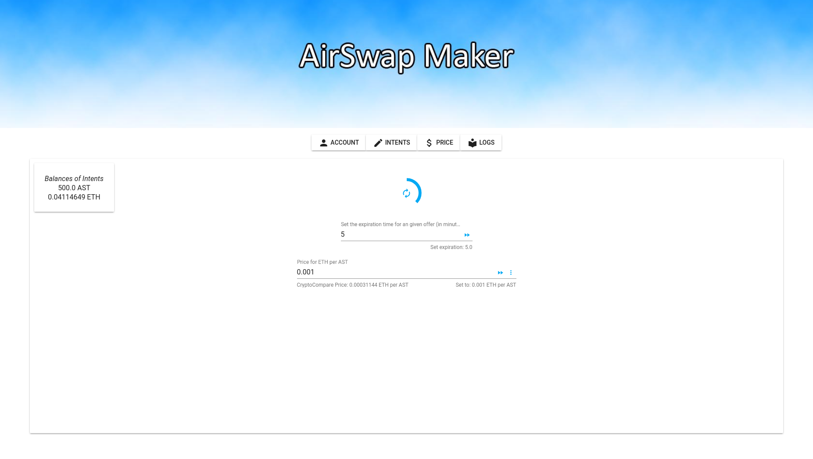

# AirSwap Maker
*This software is in early development stage. Please report any bugs you encounter. It is provided as it is and the source code is open to check.*

Powered by
[](https://angular.io/) and [](https://electron.atom.io/)

# Introduction
This is a app to run a market maker on AirSwap locally on your computer.

You log in locally with your private key or keystore file (needs to be done, so you can automatically sign order requests).


Set your intents to the indexer, where every intent you want to set needs 250 AST.


Set at which price you want to offer the token.


And then you lean back and wait for orderRequests coming in from airswap.io/trade and being taken.


The project was bootstrapped with the repo https://github.com/maximegris/angular-electron.git .
The versions are
- Angular v6.0.5
- Electron v2.0.3
- Electron Builder v20.13.4

With this sample, you can :

- Run your app in a local development environment with Electron & Hot reload
- Run your app in a production environment
- Package your app into an executable file for Linux, Windows & Mac

## Build locally from source

Clone this repository locally :

``` bash
git clone https://github.com/domidre/airswapmaker.git
```

Install dependencies with npm :

``` bash
npm install
```

There is an issue with `yarn` and `node_modules` that are only used in electron on the backend when the application is built by the packager. Please use `npm` as dependencies manager.

- **in a terminal window** -> npm start

Voila! You can use your Angular + Electron app in a local development environment with hot reload !

The application code is managed by `main.ts`. In this sample, the app runs with a simple Angular App (http://localhost:4200) and an Electron window.

Further development commands:

|Command|Description|
|--|--|
|`npm run ng:serve:web`| Execute the app in the browser |
|`npm run build`| Build the app. Your built files are in the /dist folder. |
|`npm run build:prod`| Build the app with Angular aot. Your built files are in the /dist folder. |
|`npm run electron:local`| Builds your application and start electron
|`npm run electron:linux`| Builds your application and creates an app consumable on linux system |
|`npm run electron:windows`| On a Windows OS, builds your application and creates an app consumable in windows 32/64 bit systems |
|`npm run electron:mac`|  On a MAC OS, builds your application and generates a `.app` file of your application that can be run on Mac |


*THE SOFTWARE IS PROVIDED "AS IS", WITHOUT WARRANTY OF ANY KIND, EXPRESS OR IMPLIED, INCLUDING BUT NOT LIMITED TO THE WARRANTIES OF MERCHANTABILITY, FITNESS FOR A PARTICULAR PURPOSE AND NONINFRINGEMENT. IN NO EVENT SHALL THE AUTHORS OR COPYRIGHT HOLDERS BE LIABLE FOR ANY CLAIM, DAMAGES OR OTHER LIABILITY, WHETHER IN AN ACTION OF CONTRACT, TORT OR OTHERWISE, ARISING FROM, OUT OF OR IN CONNECTION WITH THE SOFTWARE OR THE USE OR OTHER DEALINGS IN THE SOFTWARE.*


The code is provided free of charge and without profit in mind.

If you like to support the developer feel hugged <3 and feel free to donate coffees to:
0x6ceb28701476977A7FEC0A92A790951cb7AC8575